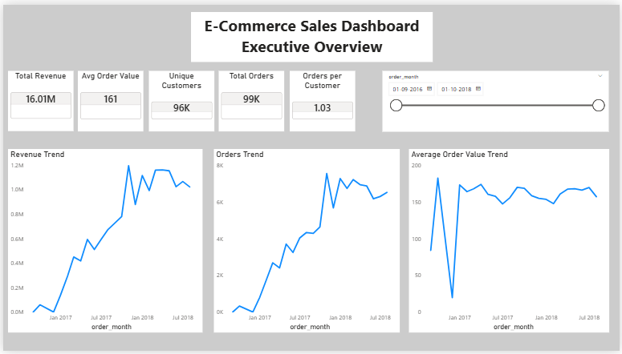
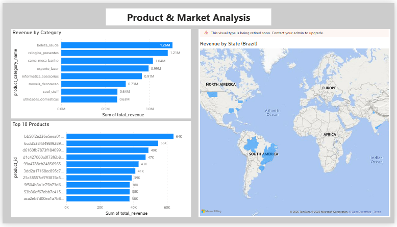

# 📊 E-Commerce Sales Dashboard (Power BI)

## Project Overview

This project presents an interactive **Power BI dashboard** that analyzes sales performance of a Brazilian e-commerce marketplace. The dashboard provides insights into revenue trends, customer behavior, product performance, and geographic sales distribution.

The objective of the project is to transform raw transactional data into meaningful business insights using **data modeling, DAX measures, and interactive visualizations**.

---

## Dataset

The dataset used in this project is the **Brazilian E-Commerce Public Dataset by Olist** available on Kaggle.

Dataset Source:
https://www.kaggle.com/datasets/olistbr/brazilian-ecommerce

The dataset contains information about:

* Customers
* Orders
* Order items
* Products
* Payments
* Reviews

---

## Dashboard Pages

### 1️⃣ Executive Overview

This page provides a high-level summary of business performance.

Key metrics displayed:

* Total Revenue
* Average Order Value
* Total Orders
* Unique Customers
* Orders per Customer

Visualizations:

* Revenue Trend over Time
* Orders Trend
* Average Order Value Trend
* Date filter for interactive analysis

---

### 2️⃣ Product & Market Analysis

This page focuses on product and regional performance.

Visualizations:

* Revenue by Product Category
* Top 10 Products by Revenue
* Revenue Distribution by State (Map)
* Tooltip insights for deeper product category analysis

Tooltip insights include:

* Units Sold by Category
* Average Product Price by Category

---

## Tools & Technologies

* Power BI
* Data Modeling
* DAX Measures
* Data Visualization
* Interactive Tooltips

---

## Key Business Insights

* Identified top performing product categories driving the highest revenue
* Analyzed geographic distribution of sales across Brazilian states
* Observed purchasing patterns and revenue growth trends over time
* Highlighted products contributing most to total revenue

---

## Dashboard Screenshots

### Executive Overview

### Product & Market Analysis

---

## Author

**Anshul Verma**

This project was created as part of a **Data Analytics portfolio** to demonstrate skills in Power BI dashboard development, data modeling, and business insight generation.
